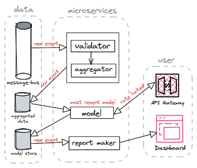

# observability-lp-author
Repository for liveProject: Kafka: Observability

# faust

1. Install faust-streaming (community edition of faust)
2. Run `docker compose up -d`
3. To consume messages from a topic called `greetings` (full history):
   1. `docker compose exec -it kafka  /opt/bitnami/kafka/bin/kafka-console-consumer.sh --bootstrap-server localhost:9092 --topic greetings --from-beginning`
   2. This executes the consumer 
   3. Alternatively, On a different terminal run `python src/faust_app.py worker -l info` to run the consumer
      1. This terminal will show the consumer logs, but only since program start (limited history).
4. Now send messages from the `faust_app.py` script and showing up in the consumer window!
   1. Execute `faust -A faust_app send @greet "Hello Faust"` based on the [guide](https://faust-streaming.github.io/faust/playbooks/quickstart.html)
   2. This part is the creator. 

## microservices

Generally the issue is that the old architecture was not event driven, and built as a monolith. 
- The triggers are manually set (running every 1 minute/based on experience), so resources badly utilized and results in unecessary costs.
- Aggregator execution time is variable depending on the amount of data. Therefore, 1 minute reruns dont make sense.
- Aggregated data can be stored in a different database to decouple the single source of truth design
	- Newly added data by Aggregator into this database can trigger Model training
- Model generated data and the model itself needs to be stored in a different database, which can then trigger a report generation.
	- Version control the model and the corresponding report
- When an api call for sentiment program comes, use the recently built model and respond with the prediction. 
- The user has to manually force reruns when new data enters.

In the new architecture, events dictate when the actions get triggered. The previous states are saved in separate databases (aggregates, and model stores) as failsafes and to save compute. 

## consumer and produecer
Launch the containers. 
- Then run the producer script after changing to src folder: `faust -A producer worker -l info`
- To see if the consumer consumed the topics: `faust -A consumer worker -l info`